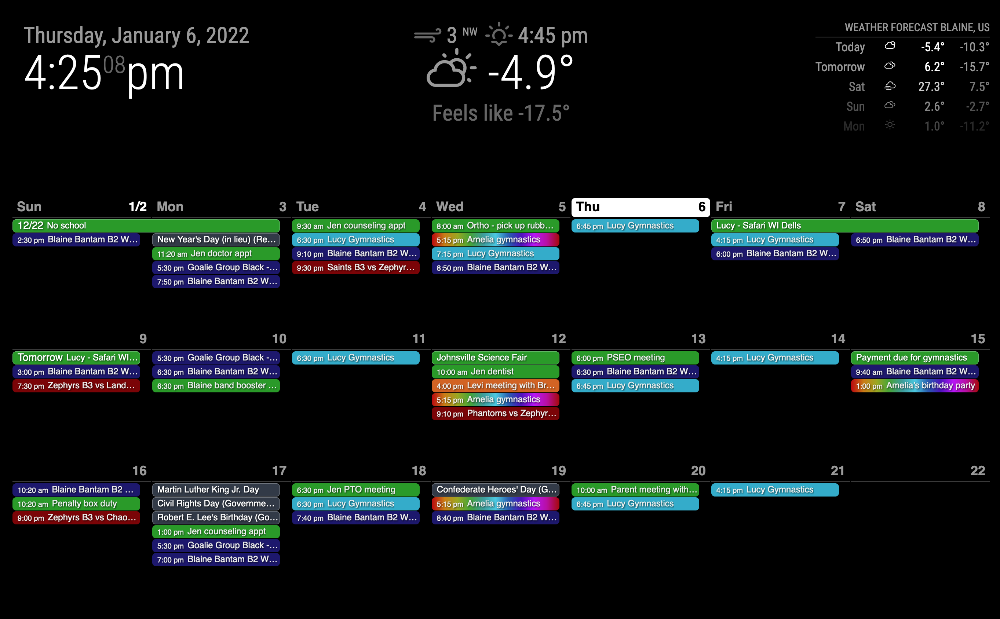

# Magic Mirror Calendaer Ext2 configuration for Family Calendar

We're a busy family and it was hard to keep everything straight.  Our calendars change and updtae often, but luckily almost every source has a public feed.  

We used magic mirror to create a self updating calendar that everyone could look at in the morning to know what was ging on for the day week or month.  Everyone has thier own color or pattern, our youngest loves rainsbows, so I made that happen for her.

Our sample custom.css and config.js is in the repo here, use and adapt as you see fit.

## Sources
I'm sure many more sources will work, but this is what we've used.
* Sports Engine
* iCloud (make a public shareable link)
* US holidays ICS feed

## Extra Modules used
* MMM-CalendarExt2
* MMPM - Great for updating and managing Config Files

